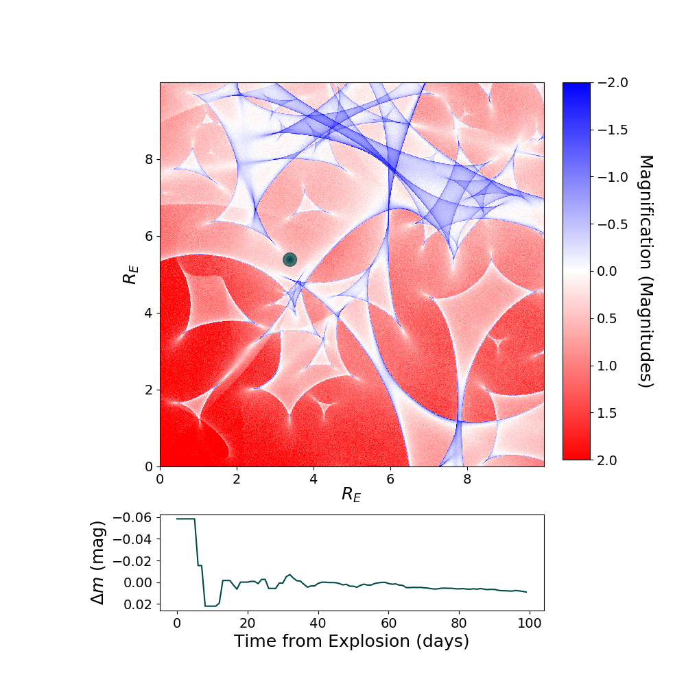
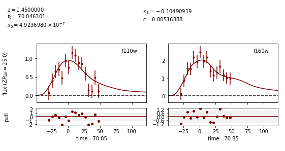
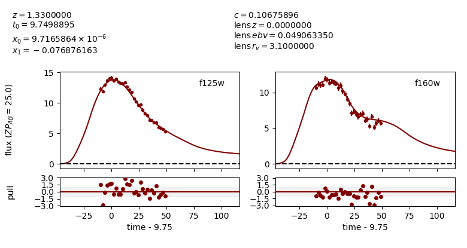
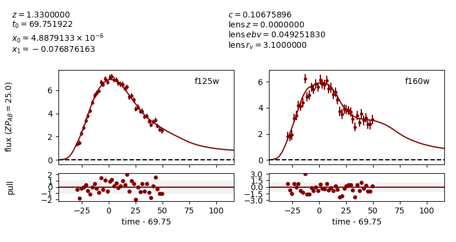

**********************
Simulating with SNTD
**********************

No Microlensing
===============

Create a simulated multiply-imaged supernova that we can then fit,
with no microlensing included in the simulation. Note that your final
printed information will be different, as this is a randomly generated
supernova.

		
.. code-block:: python     
   
     import sntd
     import matplotlib.pyplot as plt
     
     myMISN = sntd.createMultiplyImagedSN(sourcename='salt2-extended', snType='Ia', redshift=1.33,z_lens=.53, bands=['F110W','F125W'],
                   zp=[26.8,26.2], cadence=5., epochs=35.,time_delays=[10., 70.], magnifications=[7,3.5],
		   objectName='My Type Ia SN',telescopename='HST')
     print(myMISN)
     myMISN.plot_object()
     plt.show()

Out::
  
  Telescope: HST
  Object: My Type Ia SN
  Number of bands: 2
  
  ------------------
  Image: image_1:
  Bands: ['F125W', 'F110W']
  Date Range: 0.00000->56.61765
  Number of points: 24
  
  Metadata:
   z:1.33
   t0:10.0
   x0:6.705277050626183e-06
   x1:1.4432846464012696
   c:0.06617632319259452
   sourcez:1.33
   hostebv:0.0967741935483871
   lensebv:0
   lensz:0.53
   mu:7
   td:10.0
  ------------------
  Image: image_2:
  Bands: ['F125W', 'F110W']
  Date Range: 41.17647->118.38235
  Number of points: 32

  Metadata:
   z:1.33
   t0:70.0
   x0:3.3526385253130915e-06
   x1:1.4432846464012696
   c:0.06617632319259452
   sourcez:1.33
   hostebv:0.0967741935483871
   lensebv:0
   lensz:0.53
   mu:3.5
   td:70.0
  ------------------

Out:

.. image:: examples/noML_fig.png
    :width: 600px
    :align: center
    :height: 600px
    :alt: alternate text
      
Simulating Microlensing
=======================
Simulate a microlensing microcaustic, and use it to include a microlensing effect in
the simulated supernova.

.. code-block:: python

   	import numpy as np
		       
	myML=sntd.realizeMicro(nray=50,kappas=1,kappac=.3,gamma=.4)
	time,dmag=sntd.microcaustic_field_to_curve(field=myML,time=np.arange(0,100,1),zl=.5,zs=1,plot=True)
	plt.show()

Out:

.. image:: examples/micro_fig.png
    :width: 600px
    :align: center
    :height: 600px
    :alt: alternate text

Including Microlensing in Simulations
=====================================
Now we can take the simulated microcaustic and use it to include microlensing in a multiply-imaged supernova simulation.

.. code-block:: python

   	myMISN2 = sntd.createMultiplyImagedSN(sourcename='salt2-extended', snType='Ia', redshift=1.33,z_lens=.53, bands=['F110W','F125W'],
                       zp=[26.8,26.2], cadence=5., epochs=35.,time_delays=[10., 70.], magnifications=[7,3.5],
		       objectName='My Type Ia SN',telescopename='HST', microlensing_type='AchromaticMicrolensing',microlensing_params=myML)
	myMISN2.plot_object(showMicro=True)
	plt.show()

Out:

*******************************
Measuring Time Delays with SNTD
*******************************

Fitting a Multiply-Imaged Supernova
===================================
There are 3 methods built into SNTD to measure time delays (parallel, series, color). They are accessed by the same function:

**Parallel:**

.. code-block:: python

   	fitCurves=sntd.fit_data(myMISN2,snType='Ia', models='salt2-extended',bands=['F110W','F125W'],
                 params=['x0','x1','t0','c'],constants={'z':1.33},bounds={'t0':(-15,15),'x1':(-2,2),'c':(0,1)},
		             method='parallel',microlensing=None)
	fitCurves.plot_object(showFit=True,method='parallel')
	plt.show()

Out:

.. image:: examples/separateFit_fig.png
    :width: 600px
    :align: center
    :height: 600px
    :alt: alternate text

**Note that the bounds for the 't0' parameter are not absolute, the actual peak time will be estimated (unless t0_guess is defined)
and the defined bounds will be added to this value. Similarly for amplitude, where bounds are multiplicative**

Other methods are called in a similar fashion, with a couple of extra arguments:

**Series:**

.. code-block:: python
    
    fitCurves=sntd.fit_data(myMISN2,snType='Ia', models='salt2-extended',bands=['F110W','F125W'],
              params=['x0','x1','t0','c'],constants={'z':1.33},bounds={'t0':(-15,15),'x1':(-2,2),'c':(0,1)},
              seriesGrids={'td':(-5,5),'mu':(.8,1.2)},refModel=fitCurves.images['image_1'].fits.model,
              method='series',microlensing=None)

**Color:**

.. code-block:: python
    
    fitCurves=sntd.fit_data(myMISN2,snType='Ia', models='salt2-extended',bands=['F110W','F125W'],
              params=['x0','x1','t0','c'],constants={'z':1.33},bounds={'t0':(-15,15),'x1':(-2,2),'c':(0,1)},
              seriesGrids={'td':(-5,5),'mu':(.8,1.2)},refModel=fitCurves.images['image_1'].fits.model,
              method='color',microlensing=None)

Fitting Using Extra Propagation Effects
=======================================

You might also want to include other propagation effects in your fitting model, and fit relevant parameters. This can be done by
simply adding effects to an SNCosmo model, in the same way as if you were fitting a single SN with SNCosmo. First we can add some
extreme dust in the source and lens frames (your final simulations may look slightly different as **c** is chosen randomly):

.. code-block:: python

	myMISN = sntd.createMultiplyImagedSN(sourcename='salt2', snType='Ia', redshift=1.45,z_lens=.53, bands=['F110W','F160W'],
              zp=[26.9,26.2], cadence=5., epochs=35.,time_delays=[10., 70.], magnifications=[10,5],
              objectName='My Type Ia SN',telescopename='HST',av_lens=1.5,
              av_host=1)
	print(myMISN.images['image_1'].simMeta['lensebv'],
	     myMISN.images['image_1'].simMeta['hostebv'], 
	     myMISN.images['image_1'].simMeta['c'])

Out:: 

	0.48387096774193544 0.3225806451612903 0.0980253825067111

Okay, now we can fit the MISN first without taking these effects into account:

.. code-block:: python 

	fitCurves=sntd.fit_data(myMISN,snType='Ia', models='salt2',bands=['F110W','F160W'],
                                                     params=['x0','x1','t0','c'],
                                                     constants={'z':1.45},
                                                     bounds={'t0':(-15,15),'x1':(-2,2),'c':(-1,1)},
                                                     showPlots=True)

Out::

	Image 1:

.. image:: examples/example_plot_no_dust_image_1.png
    :width: 600px
    :align: center
    :height: 400px
    :alt: alternate text

Out:: 

	Image 2:

We can see that the fitter has done reasonably well, and the time delay is still accurate (True delay is 60 days). 
However, one issue is that the measured value for **c** (0.805) is vastly different than the actual value (0.098) 
as it attempts to compensate for extinction without a propagation effect. Now let's add in the propagation effects:

.. code-block:: python

	dust = sncosmo.CCM89Dust()
	salt2_model=sncosmo.Model('salt2',effects=[dust,dust],effect_names=['lens','host'],effect_frames=['free','rest'])
	fitCurves=sntd.fit_data(myMISN,snType='Ia', models=salt2_model,bands=['F110W','F160W'],
                        params=['x0','x1','t0','c','lensebv','hostebv'],
                        constants={'z':1.45,'lensr_v':3.1,'lensz':0.53,'hostr_v':3.1},
                        bounds={'t0':(-15,15),'x1':(-2,2),'c':(-1,1),'lensebv':(0,1.),'hostebv':(0,1.)},
                        showPlots=True)

Out::

	Image 1:

Out:: 

	Image 2:

Now the measured value for **c** (0.057) is much closer to reality, and the measured times of peak are somewhat
more accurate. 

Estimating Uncertainty Due to Microlensing
==========================================
Now we can estimate the additioinal uncertainty on the time delay measurement caused by microlensing. The final number printed below
is just the measured microlensing uncertainty, there is an additional uncertainty on t0 that can be combined in quadrature.

.. code-block:: python

   	fitCurves=sntd.fit_data(myMISN2,snType='Ia', models='salt2-extended',bands=['F110W','F125W'],
                params=['x0','x1','t0','c'],constants={'z':1.33},bounds={'t0':(-15,15),'x1':(-2,2),'c':(0,1)},
		method='parallel',microlensing='achromatic',nMicroSamples=10)
	print(fitCurves.images['image_1'].fits.final_errs['micro'])

Out::

  0.7979254133200879

*****************************
Using Your Own Data with SNTD
*****************************
In order to fit your own data, you must turn your light curve into an astropy table. There is an example multiply-imaged
SN example provided for reference. In this example, we have a doubly-imaged SN with image files (in the sntd/data/examples folder)
'example_image_1.dat' and 'example_image_2.dat'. The only optional column in these files is "image", which sets the name of the key
used to reference this SN image. If you do not provide flux/fluxerr but instead magnitude/magerr SNTD will attemp to translate to
flux/fluxerr, but it's best to simply provide flux from the beginning to avoid conversion errors. First we can read in these tables:

.. code-block:: python
	
	ex_1,ex_2=sntd.load_example_data()
	print(ex_1)

Out:: 

	       time         band        flux        ...  zp  zpsys  image 
	------------------ ----- ------------------ ... ---- ----- -------
	               0.0 F125W  64.59429430606906 ... 26.8    AB image_1
	2.0224719101123596 F125W    62.408324396966 ... 26.8    AB image_1
	 4.044943820224719 F125W  68.10359798573809 ... 26.8    AB image_1
	 6.067415730337078 F125W  71.76160753594853 ... 26.8    AB image_1
	 8.089887640449438 F125W  73.43467553050705 ... 26.8    AB image_1
	10.112359550561798 F125W  74.34296720689296 ... 26.8    AB image_1
	12.134831460674157 F125W  71.73347707161632 ... 26.8    AB image_1
	14.157303370786517 F125W  72.93187923529568 ... 26.8    AB image_1
	16.179775280898877 F125W  70.64111678688164 ... 26.8    AB image_1
	18.202247191011235 F125W  69.31085357488871 ... 26.8    AB image_1
	               ...   ...                ... ...  ...   ...     ...
	38.426966292134836 F160W 19.950527074094737 ... 26.2    AB image_1
	40.449438202247194 F160W 20.963076283234553 ... 26.2    AB image_1
	 42.47191011235955 F160W 21.402880246191344 ... 26.2    AB image_1
	 44.49438202247191 F160W  18.28098879531828 ... 26.2    AB image_1
	 46.51685393258427 F160W 18.947732390210522 ... 26.2    AB image_1
	 48.53932584269663 F160W 15.987591900959364 ... 26.2    AB image_1
	 50.56179775280899 F160W 20.011941798193966 ... 26.2    AB image_1
	 52.58426966292135 F160W 15.516064719260328 ... 26.2    AB image_1
	 54.60674157303371 F160W   17.1543325162061 ... 26.2    AB image_1
	 56.62921348314607 F160W  18.25136177909449 ... 26.2    AB image_1
	58.651685393258425 F160W 17.198071229182016 ... 26.2    AB image_1
	Length = 60 rows

Now, to turn these two data tables into an SNTD curveDict object that will be fit, we use the table_factory function:

.. code-block:: python

	new_MISN=sntd.table_factory([ex_1,ex_2],telescopename='HST',object_name='example_SN')
	print(new_MISN)

Out::

	Telescope: HST
	Object: example_SN
	Number of bands: 2

	------------------
	Image: image_1:
	Bands: set(['F160W', 'F125W'])
	Date Range: 0.00000->58.65169
	Number of points: 60
	------------------
	Image: image_2:
	Bands: set(['F160W', 'F125W'])
	Date Range: 40.44944->119.32584
	Number of points: 80
	------------------

And finally let's fit this SN, which is a Type Ia, with the SALT2 model (your exact time delay may
be slightly different after fitting the example data). For reference, the true delay here is 60 days.

.. code-block:: python

	fitCurves=sntd.fit_data(new_MISN,snType='Ia', models='salt2',bands=['F125W','F160W'],
                        params=['x0','x1','t0','c'],constants={'z':1.33},
                        bounds={'t0':(-15,15),'x1':(-2,2),'c':(0,1)})
	print(fitCurves.time_delays)
	fitCurves.plot_object(showFit=True)
	plt.show()

Out::

	{'image_1': 0, 'image_2': 60.2649320870058}

.. image:: examples/example_fit.png
    :width: 600px
    :align: center
    :height: 600px
    :alt: alternate text

****************************************
Batch Processing Time Delay Measurements
****************************************

Parallel processing is built into SNTD in order to fit a large number of MISN. To access this feature,
simply provide a list of MISN instead of a single sntd curveDict object:

.. code-block:: python

  myMISN1 = sntd.createMultiplyImagedSN(sourcename='salt2-extended', snType='Ia', redshift=1.33,z_lens=.53, bands=['F110W','F125W'],
                   zp=[26.8,26.2], cadence=5., epochs=35.,time_delays=[10., 70.], magnifications=[7,3.5],
       objectName='My Type Ia SN',telescopename='HST')
  myMISN2 = sntd.createMultiplyImagedSN(sourcename='salt2-extended', snType='Ia', redshift=1.33,z_lens=.53, bands=['F110W','F125W'],
                   zp=[26.8,26.2], cadence=5., epochs=35.,time_delays=[10., 50.], magnifications=[7,3.5],
       objectName='My Type Ia SN',telescopename='HST')
  curve_list=[myMISN1,myMISN2]
  fitCurves=sntd.fit_data(curve_list,snType='Ia', models='salt2-extended',bands=['F125W','F160W'],
      params=['x0','x1','t0','c'],constants={'z':1.33},bounds={'t0':(-15,15),'x1':(-2,2),'c':(0,1)},
      method='parallel',microlensing=None)
  for curve in fitCurves:
    print(curve.time_delays)

Out::

  Fitting MISN number 1...
  Fitting MISN number 2...
  {'image_1': 0, 'image_2': 60.32583528844834}
  {'image_1': 0, 'image_2': 40.22834982372733}

