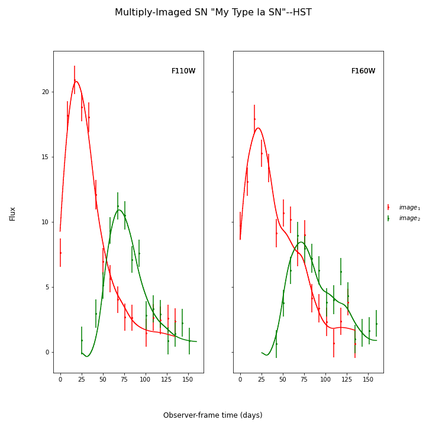
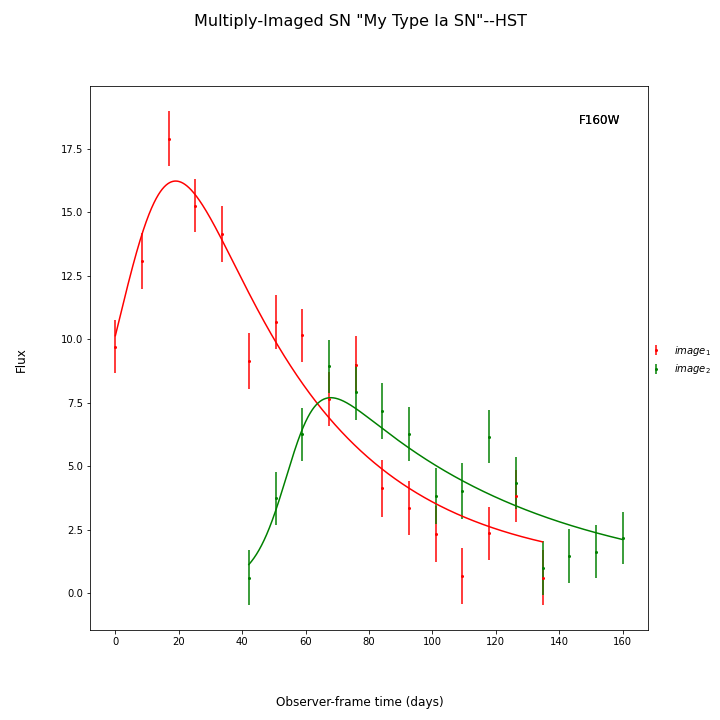

*******************
Using Your Own Data
*******************
In order to fit your own data, you must turn your light curve into an astropy table. There is an example multiply-imaged
SN example provided for reference. In this example, we have a doubly-imaged SN with image files (in the ``sntd/data/examples`` folder)
``example_image_1.dat`` and ``example_image_2.dat``. The only optional column in these files is ``image``, which sets the name of the key
used to reference this SN image. If you do not provide ``flux``/``fluxerr`` but instead ``magnitude``/``magerr`` SNTD will attemp to translate to
``flux``/``fluxerr``, but it's best to simply provide flux from the beginning to avoid conversion errors. First we can read in these tables:

.. code-block:: python
	
	ex_1,ex_2=sntd.load_example_data()
	print(ex_1)

Out:: 

	       time         band        flux        ...  zp  zpsys  image 
	------------------ ----- ------------------ ... ---- ----- -------
	               0.0 F110W  37.19064872538628 ... 26.8    AB image_1
	 5.147058823529412 F110W  50.32055546444027 ... 26.8    AB image_1
	10.294117647058824 F110W  58.82844698903818 ... 26.8    AB image_1
	15.441176470588236 F110W  65.97476390948702 ... 26.8    AB image_1
	 20.58823529411765 F110W  68.59997144436151 ... 26.8    AB image_1
	 25.73529411764706 F110W  65.41632106171966 ... 26.8    AB image_1
	 30.88235294117647 F110W  59.41782422093636 ... 26.8    AB image_1
	36.029411764705884 F110W 54.662097309508674 ... 26.8    AB image_1
	  41.1764705882353 F110W 47.645924536421205 ... 26.8    AB image_1
	 46.32352941176471 F110W  40.80754042147044 ... 26.8    AB image_1
	               ...   ...                ... ...  ...   ...     ...
	              87.5 F160W 19.004911887838812 ... 26.2    AB image_1
	 92.64705882352942 F160W 16.193649480155404 ... 26.2    AB image_1
	 97.79411764705883 F160W  13.44274461829073 ... 26.2    AB image_1
	102.94117647058825 F160W 12.231192259725086 ... 26.2    AB image_1
	108.08823529411765 F160W 10.071258263342276 ... 26.2    AB image_1
	113.23529411764707 F160W 11.750167963069211 ... 26.2    AB image_1
	118.38235294117648 F160W  9.962239538490955 ... 26.2    AB image_1
	123.52941176470588 F160W 6.9499842149097075 ... 26.2    AB image_1
	 128.6764705882353 F160W  6.479431333100114 ... 26.2    AB image_1
	133.82352941176472 F160W  7.288367029732507 ... 26.2    AB image_1
	138.97058823529412 F160W  6.416746741653151 ... 26.2    AB image_1

Now, to turn these two data tables into an :py:class:`~sntd.curve_io.curveDict` object that will be fit, we use the :py:func:`~sntd.curve_io.table_factory` function:

.. code-block:: python

	new_MISN=sntd.table_factory([ex_1,ex_2],telescopename='HST',object_name='example_SN')
	print(new_MISN)

Out::

	Telescope: HST
	Object: example_SN
	Number of bands: 2

	------------------
	Image: image_1:
	Bands: set(['F160W', 'F125W'])
	Date Range: 0.00000->58.65169
	Number of points: 60
	------------------
	Image: image_2:
	Bands: set(['F160W', 'F125W'])
	Date Range: 40.44944->119.32584
	Number of points: 80
	------------------

And finally let's fit this SN, which is a Type Ia, with the SALT2 model (your exact time delay may
be slightly different after fitting the example data). For reference, the true delay here is 60 days.

.. code-block:: python

	fitCurves=sntd.fit_data(new_MISN,snType='Ia', models='salt2',bands=['F125W','F160W'],
                        params=['x0','x1','t0','c'],constants={'z':1.33},
                        bounds={'t0':(-15,15),'x1':(-2,2),'c':(0,1)})
	print(fitCurves.parallel.time_delays)
	fitCurves.plot_object(showFit=True)
	plt.show()

Out::

	{'image_1': 0, 'image_2': 60.2649320870058}

*********************
Uknown Supernova Type
*********************

You may not know that your SN is a Type Ia (as other examples here and in :ref:`examples/plot_fitting:Measuring Time Delays`).
In that case you have two more options. You could use the parameterized `Bazin model <https://ui.adsabs.harvard.edu/abs/2009A%26A...499..653B/abstract>`_:

.. code-block:: python

	fitCurves=sntd.fit_data(new_MISN,snType='Ia', models='Bazin',bands=['F140W'],
	            params=['t0','B','amplitude','rise','fall'],refImage='image_1',cut_time=None,#[-100,100],
	            bounds={'t0':(-20,20),'amplitude':(.1,100),'rise':(1,200),'fall':(1,200),'B':(0,1),
	                   'td':(-20,20),'mu':(.5,2)},
	            fitOrder=['image_1','image_2'],fit_prior=None,minsnr=3,trial_fit=True,
	            method='parallel',microlensing=None,modelcov=False,npoints=100,
	                        maxiter=None)
	fitCurves.plot_object(showFit=True)
	print(fitCurves.parallel.time_delays)

Out::
	
	{'image_1': 0, 'image_2': 50.63220454625854}

Another option is to fit multiple models from different SN types. SNTD will choose the "best" model using the Bayesian Evidence.

.. code-block:: python

	fitCurves=sntd.fit_data(new_MISN,snType='Ia', models=['salt2-extended','hsiao','snana-2004gq',
            'snana-2004fe','snana-2004gv','snana-2007nc'],
            bands=['F110W','F140W'],cut_time=[-500,30],
            params=['x0','t0','x1','c','amplitude'],constants={'z':1.33},refImage='image_1',
            bounds={'t0':(-20,20),'x1':(-3,3),'c':(-1,1),'td':(-20,20),'mu':(.5,2)},
            fitOrder=['image_2','image_1'],trial_fit=True,minsnr=3,
            method='parallel',microlensing=None,modelcov=False,npoints=50,clip_data=True,
            maxiter=None)

****************************************
Batch Processing Time Delay Measurements
****************************************

Parallel processing and batch processing is built into SNTD in order to fit a large number of (likely simulated) MISN. To access this feature,
simply provide a list of MISN instead of a single :py:class:`~sntd.curve_io.curveDict` object, specifying whether you want to use multiprocessing (split the list across multiple cores)
or batch processing (splitting the list into multiple jobs with sbatch). If you specify batch mode, you need to provide
the partition and number of jobs you want to implement. 

.. code-block:: python

  myMISN1 = sntd.createMultiplyImagedSN(sourcename='salt2-extended', snType='Ia', redshift=1.33,z_lens=.53, bands=['F110W','F125W'],
                   zp=[26.8,26.2], cadence=5., epochs=35.,time_delays=[10., 70.], magnifications=[7,3.5],
       objectName='My Type Ia SN',telescopename='HST')
  myMISN2 = sntd.createMultiplyImagedSN(sourcename='salt2-extended', snType='Ia', redshift=1.33,z_lens=.53, bands=['F110W','F125W'],
                   zp=[26.8,26.2], cadence=5., epochs=35.,time_delays=[10., 50.], magnifications=[7,3.5],
       objectName='My Type Ia SN',telescopename='HST')
  curve_list=[myMISN1,myMISN2]
  fitCurves=sntd.fit_data(curve_list,snType='Ia', models='salt2-extended',bands=['F110W','F125W'],
                    params=['x0','t0','x1','c'],constants={'z':1.3},refImage='image_1',
                    bounds={'t0':(-20,20),'x1':(-3,3),'c':(-1,1)},fitOrder=['image_2','image_1'],
                    method='parallel',npoints=1000,par_or_batch='batch', batch_partition='myPartition',nbatch_jobs=2)

  for curve in fitCurves:
    print(curve.parallel.time_delays)
  
  fitCurves=sntd.fit_data(curve_list,snType='Ia', models='salt2-extended',bands=['F110W','F125W'],
                    params=['x0','t0','x1','c'],constants={'z':1.3},refImage='image_1',
                    bounds={'t0':(-20,20),'x1':(-3,3),'c':(-1,1)},fitOrder=['image_2','image_1'],
                    method='parallel',npoints=1000,par_or_batch='parallel')
  for curve in fitCurves:
    print(curve.parallel.time_delays)

Out::

  Submitted batch job 5784720
  {'image_1': 0, 'image_2': 60.3528844834}
  {'image_1': 0, 'image_2': 40.34982372733}
  Fitting MISN number 1...
  Fitting MISN number 2...
  {'image_1': 0, 'image_2': 60.32583528844834}
  {'image_1': 0, 'image_2': 40.22834982372733}

If you would like to run multiple methods in a row in batch mode, the recommended way is by providing a list of the methods to the :py:func:`~sntd.fitting.fit_data` function. You 
can have it use the parallel fit as a prior on the subsequent fits by setting ``fit_prior`` to ``True`` instead of giving it a :py:class:`~sntd.curve_io.curveDict` object.

.. code-block:: python

  
  fitCurves_batch=sntd.fit_data(curve_list,snType='Ia', models='salt2-extended',bands=['F110W','F125W'],
                    params=['x0','t0','x1','c'],constants={'z':1.3},refImage='image_1',fit_prior=True,
                    bounds={'t0':(-20,20),'x1':(-3,3),'c':(-1,1)},fitOrder=['image_2','image_1'],
                    method=['parallel','series','color'],npoints=1000,par_or_batch='batch', batch_partition='myPartition',nbatch_jobs=2)
