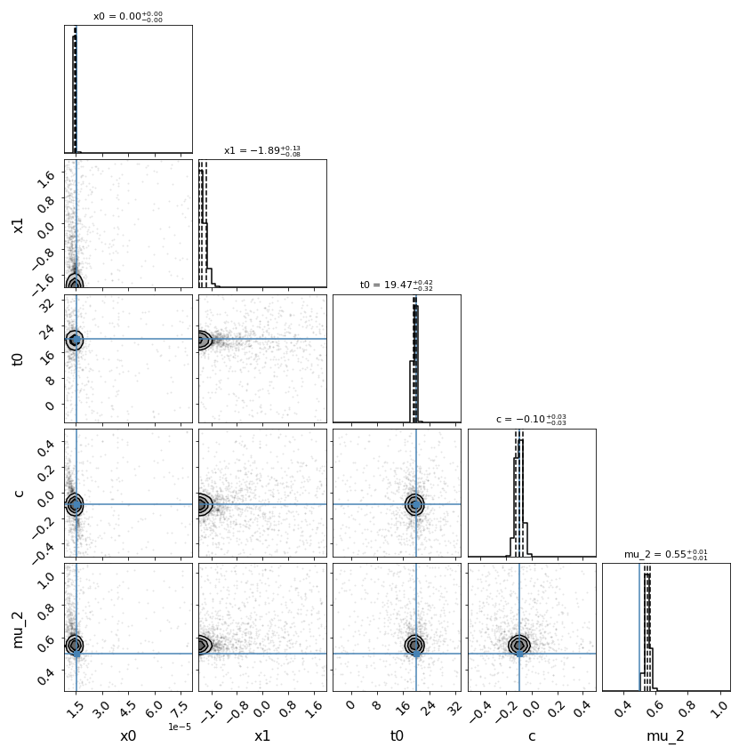
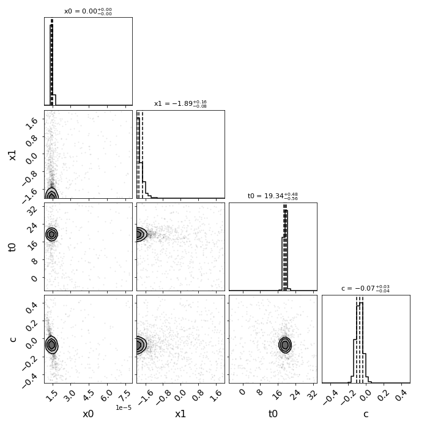

*******************
Using Your Own Data
*******************
In order to fit your own data, you must turn your light curve into an astropy table. There is an example multiply-imaged
SN example provided for reference. In this example, we have a doubly-imaged SN with image files (in the ``sntd/data/examples`` folder, what you see when running this code may be slightly different)
``example_image_1.dat`` and ``example_image_2.dat``. The only optional column in these files is ``image``, which sets the name of the key
used to reference this SN image. If you do not provide ``flux``/``fluxerr`` but instead ``magnitude``/``magerr`` SNTD will attemp to translate to
``flux``/``fluxerr``, but it's best to simply provide flux from the beginning to avoid conversion errors. First we can read in these tables:

.. code-block:: python
	
	ex_1,ex_2=sntd.load_example_data()
	print(ex_1)

Out:: 

       time         band        flux             fluxerr        zp zpsys  image 
	------------------ ----- ------------------ ------------------ --- ----- -------
	               0.0 F110W   7.62584933633316 1.0755597651249478  25    AB image_1
	 8.421052631578947 F110W  18.14416283987298 1.1095627479983372  25    AB image_1
	16.842105263157894 F110W  20.89546596937984 1.0789885092102118  25    AB image_1
	25.263157894736842 F110W  18.79112295341033 1.0989312899693982  25    AB image_1
	 33.68421052631579 F110W  18.02156628265722   1.12828303196303  25    AB image_1
	 42.10526315789473 F110W 12.085231206169226 1.1179040967533518  25    AB image_1
	50.526315789473685 F110W  6.962961065741445 1.0339735940234938  25    AB image_1
	 58.94736842105263 F110W   5.62540442388384 1.0359032050500712  25    AB image_1
	 67.36842105263158 F110W 4.0345924798153305   1.01660451026687  25    AB image_1
	 75.78947368421052 F110W 2.6846046764855243 1.0526764468991552  25    AB image_1
	               ...   ...                ...                ... ...   ...     ...
	50.526315789473685 F160W 10.672033110263037   1.05358904440353  25    AB image_1
	 58.94736842105263 F160W 10.152052390226839 1.0434013477890232  25    AB image_1
	 67.36842105263158 F160W 7.6435469190906415 1.0575259139938555  25    AB image_1
	 75.78947368421052 F160W  9.001903536381562 1.1095984293220644  25    AB image_1
	 84.21052631578947 F160W  4.136105731166709 1.1086683584388777  25    AB image_1
	 92.63157894736841 F160W  3.361829966775289  1.074708117236386  25    AB image_1
	101.05263157894737 F160W 2.3313546542843953 1.0952338255910397  25    AB image_1
	109.47368421052632 F160W 0.6946360860451652  1.088838824485642  25    AB image_1
	117.89473684210526 F160W 2.3779217294236012  1.042417668422105  25    AB image_1
	 126.3157894736842 F160W  3.834499918918735 1.0138401599728672  25    AB image_1
	134.73684210526315 F160W  0.623370473979624 1.0693683341393225  25    AB image_1
	Length = 33 rows

Now, to turn these two data tables into an :py:class:`~sntd.curve_io.MISN` object that will be fit, we use the :py:func:`~sntd.curve_io.table_factory` function:

.. code-block:: python

	new_MISN=sntd.table_factory([ex_1,ex_2],telescopename='HST',object_name='example_SN')
	print(new_MISN)

Out::

	Telescope: HST
	Object: example_SN
	Number of bands: 2

	------------------
	Image: image_1:
	Bands: {'F160W', 'F110W'}
	Date Range: 0.00000->134.73684
	Number of points: 33
	------------------
	Image: image_2:
	Bands: {'F160W', 'F110W'}
	Date Range: 25.26316->160.00000
	Number of points: 30
	------------------

And finally let's fit this SN, which is a Type Ia, with the SALT2 model (your exact time delay may
be slightly different after fitting the example data). For reference, the true delay here is 50 days.

.. code-block:: python

	fitCurves=sntd.fit_data(new_MISN,snType='Ia', models='salt2-extended',bands=['F110W','F160W'],
                        params=['x0','x1','t0','c'],constants={'z':1.4},
                        bounds={'t0':(-25,25),'x1':(-2,2),'c':(-1,1)})
	print(fitCurves.parallel.time_delays)
	fitCurves.plot_object(showFit=True)
	plt.show()

Out::

	{'image_1': 0, 'image_2': 50.28975081972289}

.. image:: _static/example_fit.png
    :width: 600px
    :align: center
    :height: 600px
    :alt: alternate text

*********************
Uknown Supernova Type
*********************

You may not know that your SN is a Type Ia (as other examples here and in :ref:`sphx_glr_examples_plot_c_fitting.py`).
In that case you have two more options. You could use the parameterized `Bazin model <https://ui.adsabs.harvard.edu/abs/2009A%26A...499..653B/abstract>`_:

.. code-block:: python

	fitCurves=sntd.fit_data(new_MISN,snType='Ia', models='Bazin',bands=['F160W'],
	            params=['t0','B','amplitude','rise','fall'],refImage='image_1',cut_time=None,
	            bounds={'t0':(-20,20),'amplitude':(.1,100),'rise':(1,200),'fall':(1,200),'B':(0,1),
	                   'td':(-20,20),'mu':(.5,2)},
	            fitOrder=['image_1','image_2'],fit_prior=None,minsnr=3,trial_fit=True,
	            method='parallel',microlensing=None,modelcov=False,npoints=100,
	                        maxiter=None)
	fitCurves.plot_object(showFit=True)
	print(fitCurves.parallel.time_delays)

Out::
	
	{'image_1': 0, 'image_2': 49.40967718450336}

.. image:: _static/bazin.png
    :width: 600px
    :align: center
    :height: 600px
    :alt: alternate text

Another option is to fit multiple models from different SN types. SNTD will choose the "best" model using the Bayesian Evidence.

.. code-block:: python

	fitCurves=sntd.fit_data(new_MISN,snType='Ia', models=['salt2-extended','hsiao','snana-2004gq',
            'snana-2004fe','snana-2004gv','snana-2007nc'],
            bands=['F110W','F140W'],cut_time=[-500,30],
            params=['x0','t0','x1','c','amplitude'],constants={'z':1.33},refImage='image_1',
            bounds={'t0':(-20,20),'x1':(-3,3),'c':(-1,1),'td':(-20,20),'mu':(.5,2)},
            fitOrder=['image_2','image_1'],trial_fit=True,minsnr=3,
            method='parallel',microlensing=None,modelcov=False,npoints=50,clip_data=True,
            maxiter=None)

****************************************
Batch Processing Time Delay Measurements
****************************************

Parallel processing and batch processing is built into SNTD in order to fit a large number of (likely simulated) MISN. To access this feature,
simply provide a list of MISN instead of a single :py:class:`~sntd.curve_io.MISN` object, specifying whether you want to use multiprocessing (split the list across multiple cores)
or batch processing (splitting the list into multiple jobs with sbatch). If you specify batch mode, you need to provide
the partition and number of jobs you want to implement or the number of lensed SN you want to fit per node. 

.. code-block:: python

  myMISN1 = sntd.createMultiplyImagedSN(sourcename='salt2-extended', snType='Ia', redshift=1.33,z_lens=.53, bands=['F110W','F125W'],
                   zp=[26.8,26.2], cadence=5., epochs=35.,time_delays=[10., 70.], magnifications=[7,3.5],
       objectName='My Type Ia SN',telescopename='HST')
  myMISN2 = sntd.createMultiplyImagedSN(sourcename='salt2-extended', snType='Ia', redshift=1.33,z_lens=.53, bands=['F110W','F125W'],
                   zp=[26.8,26.2], cadence=5., epochs=35.,time_delays=[10., 50.], magnifications=[7,3.5],
       objectName='My Type Ia SN',telescopename='HST')
  curve_list=[myMISN1,myMISN2]
  fitCurves=sntd.fit_data(curve_list,snType='Ia', models='salt2-extended',bands=['F110W','F125W'],
                    params=['x0','t0','x1','c'],constants={'z':1.3},refImage='image_1',
                    bounds={'t0':(-20,20),'x1':(-3,3),'c':(-1,1)},fitOrder=['image_2','image_1'],
                    method='parallel',npoints=1000,par_or_batch='batch', batch_partition='myPartition',nbatch_jobs=2)

  for curve in fitCurves:
    print(curve.parallel.time_delays)
  
  fitCurves=sntd.fit_data(curve_list,snType='Ia', models='salt2-extended',bands=['F110W','F125W'],
                    params=['x0','t0','x1','c'],constants={'z':1.3},refImage='image_1',
                    bounds={'t0':(-20,20),'x1':(-3,3),'c':(-1,1)},fitOrder=['image_2','image_1'],
                    method='parallel',npoints=1000,par_or_batch='parallel')
  for curve in fitCurves:
    print(curve.parallel.time_delays)

Out::

  Submitted batch job 5784720
  {'image_1': 0, 'image_2': 60.3528844834}
  {'image_1': 0, 'image_2': 40.34982372733}
  Fitting MISN number 1...
  Fitting MISN number 2...
  {'image_1': 0, 'image_2': 60.32583528844834}
  {'image_1': 0, 'image_2': 40.22834982372733}

You can also use batch processing and multiprocssing (using N cores per node across M cores using Slurm):

.. code-block:: python

	fitCurves=sntd.fit_data(curve_list,snType='Ia', models='salt2-extended',bands=['F110W','F125W'],
                    params=['x0','t0','x1','c'],constants={'z':1.3},refImage='image_1',
                    bounds={'t0':(-20,20),'x1':(-3,3),'c':(-1,1)},fitOrder=['image_2','image_1'],n_cores_per_node=2,
                    method='parallel',npoints=1000,par_or_batch='batch', batch_partition='myPartition',nbatch_jobs=1)

If you would like to run multiple methods in a row in batch mode, the recommended way is by providing a list of the methods to the :py:func:`~sntd.fitting.fit_data` function. You 
can have it use the parallel fit as a prior on the subsequent fits by setting ``fit_prior`` to ``True`` instead of giving it a :py:class:`~sntd.curve_io.MISN` object.

.. code-block:: python

  
  fitCurves_batch=sntd.fit_data(curve_list,snType='Ia', models='salt2-extended',bands=['F110W','F125W'],
                    params=['x0','t0','x1','c'],constants={'z':1.3},refImage='image_1',fit_prior=True,
                    bounds={'t0':(-20,20),'x1':(-3,3),'c':(-1,1)},fitOrder=['image_2','image_1'],
                    method=['parallel','series','color'],npoints=1000,par_or_batch='batch', batch_partition='myPartition',nbatch_jobs=2)

*************************
Fitting Model Params Only
*************************

You can also easily fix the time delays (for the series or color method) and/or magnifications (series method only) while fitting a light curve model:

.. code-block:: python

  myMISN = sntd.load_example_misn()
  fitCurves=sntd.fit_data(myMISN,snType='Ia',models='salt2-extended',bands=['F110W','F160W'],
                        params=['x0','x1','t0','c'],constants={'z':1.4,'td':{'image_1':0,'image_2':50}},
                     	refImage='image_1',trial_fit=False,
			bounds={'t0':(-20,20),'mu':(.5,2),'x1':(-2,2),'c':(-.5,.5)},
			method='series',npoints=100)
  print(fitCurves.series.time_delays)
  print(fitCurves.series.magnifications)
  fitCurves.plot_fit(method='series')
  plt.show()

Out::
	
	{'image_1': 0, 'image_2': 50}
	{'image_1': 1, 'image_2': 0.5496620676889558}

.. code-block:: python

  myMISN = sntd.load_example_misn()
  fitCurves=sntd.fit_data(myMISN,snType='Ia',models='salt2-extended',bands=['F110W','F160W'],
                        params=['x0','x1','t0','c'],constants={'z':1.4,'mu':{'image_1':1,'image_2':0.5}},
                     	refImage='image_1',trial_fit=False,
        		bounds={'t0':(-20,20),'mu':(.5,2),'x1':(-2,2),'c':(-.5,.5)},
        		method='series',npoints=100)
  print(fitCurves.series.time_delays)
  print(fitCurves.series.magnifications)
  fitCurves.plot_fit(method='series')
  plt.show()

Out::

	{'image_1': 0, 'image_2': 50.29975290189155}
	{'image_1': 1, 'image_2': 0.5}

.. image:: _static/fix_mu.png
    :width: 600px
    :align: center
    :height: 600px
    :alt: alternate text

.. code-block:: python

  myMISN = sntd.load_example_misn()
  fitCurves=sntd.fit_data(myMISN,snType='Ia',models='salt2-extended',bands=['F110W','F160W'],
                        params=['x0','x1','t0','c'],constants={'z':1.4,'td':{'image_1':0,'image_2':50},'mu':{'image_1':1,'image_2':0.5}},
                     	refImage='image_1',trial_fit=False,
        		bounds={'t0':(-20,20),'mu':(.5,2),'x1':(-2,2),'c':(-.5,.5)},
        		method='series',npoints=100)
  print(fitCurves.series.time_delays)
  print(fitCurves.series.magnifications)
  fitCurves.plot_fit(method='series')
  plt.show()

Out::

	{'image_1': 0, 'image_2': 50}
	{'image_1': 1, 'image_2': 0.5}

